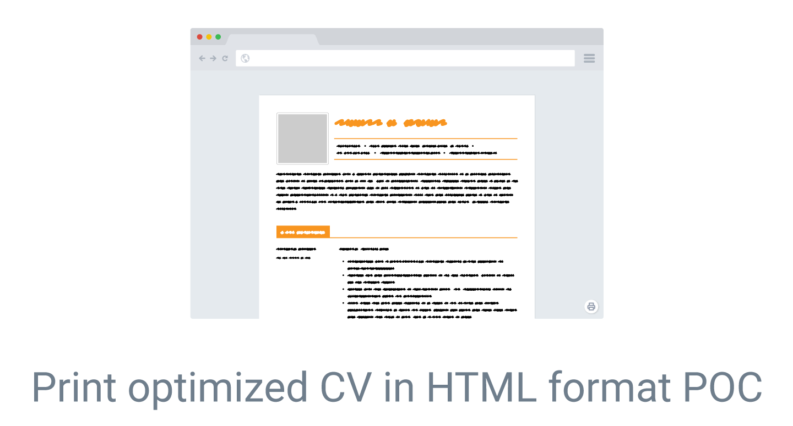
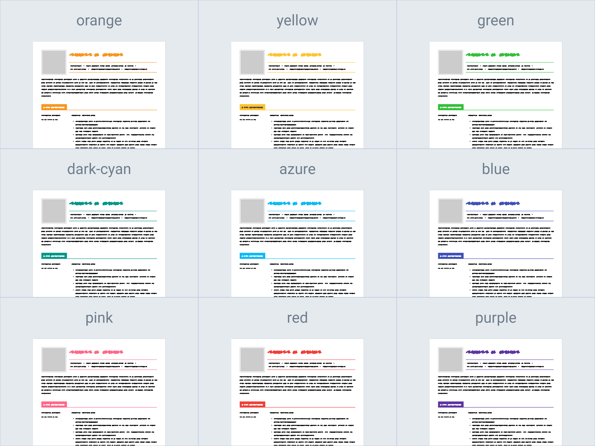

<p align="center">
    
</p>

<p align="center">
    A proof of concept to make nice-looking CV in a self-contained HTML file, and support printing like normal Word or PDF documents.
</p>

<p align="center">
    <a href="./LICENSE">
        
    </a>
</p>

---

## Demos

### Google Chrome on macOS

https://user-images.githubusercontent.com/6780420/176546428-b7e08577-8ec7-411e-b27e-2fa9c28287d1.mp4

### Google Chrome on Android

https://user-images.githubusercontent.com/6780420/176546465-2a9d1ae0-b3ff-4566-ab74-799407b9f9e5.mp4

### Live Demo

[Preview link](https://icelam.github.io/html-cv-poc/)

## Supported Browsers

|                 | Display                          | Print                                                                                                                                                                                          |
| --------------- | -------------------------------- | ---------------------------------------------------------------------------------------------------------------------------------------------------------------------------------------------- |
| Google Chrome   | Yes                              | Yes, except iOS version                                                                                                                                                                        |
| Mozilla Firefox | Yes                              | Yes, except Android and iOS version                                                                                                                                                            |
| Microsoft Edge  | Yes (Tested on Chromium version) | Yes (Tested on Chromium version)                                                                                                                                                               |
| Apple Safari    | Yes                              | Limited support until Safari can support [`@page`](https://developer.mozilla.org/en-US/docs/Web/CSS/@page) media, check the support status on [Can I use](https://caniuse.com/css-paged-media) |

### Available Themes

There are 9 ready-to-use themes. To change the theme, simply change the `data-theme` attribute in `<body>` tag.

```diff
- <body data-theme="orange">
+ <body data-theme="azure">
```

Below are the themes available:



## Development Notes

Everything, including contents and styles are self-contained within `index.html`. To preview the changes, simply open `index.html` in any supported browsers listed in the "[Supported Browsers](#supported-browsers)" section. For frequent updates and preview, you can serve the page in any development server that support live realod, for instance [`es-dev-server`](https://www.npmjs.com/package/es-dev-server).

### Starting a development server

A development server which support live reload can be start with the below command:

```bash
# Assuming Node.js and npm is properly installed
npx es-dev-server@2.1.0 --root-dir ./ --app-index index.html --node-resolve --watch --open --port 8000
```
